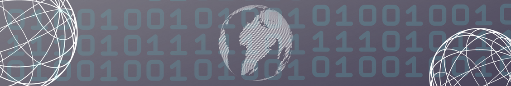

### Hi there 👋, my name is Anja
#### I'm a mathematician and a developer

I'm Anja from Germany. I graduated mathematics with focus on technology and programming from 'Berliner Hochschule für Technik'. 

Skills: C++, C#, Python, mySQL, Matlab, Javascript

- 🔭 I’m currently working on my own custom PDF converter in python. 
- 🌱 I’m currently expenting my python knowledge 
- 😄 Pronouns: she/her 
- ⚡ Fun fact: I love to read, solve puzzles and take care of my house plants. 

    

 
